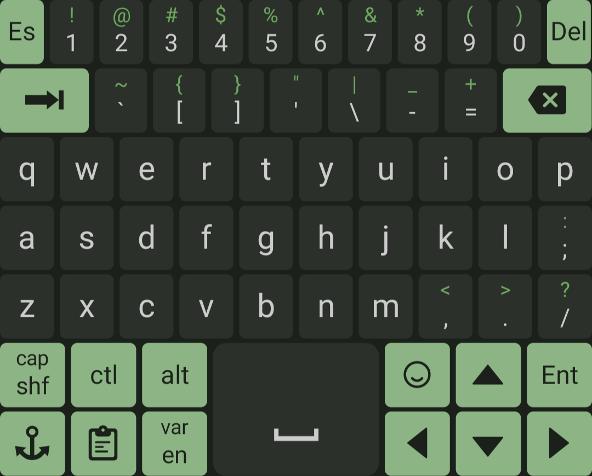
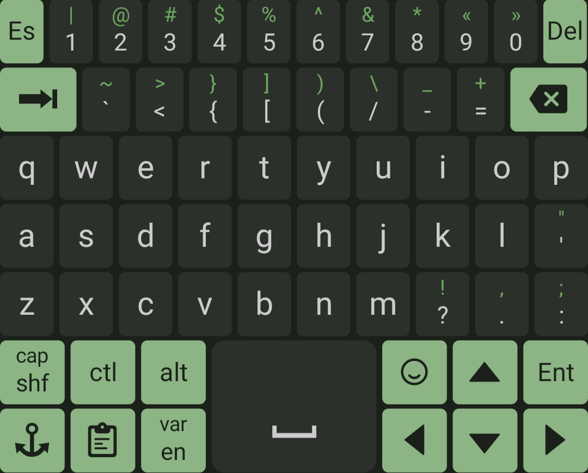
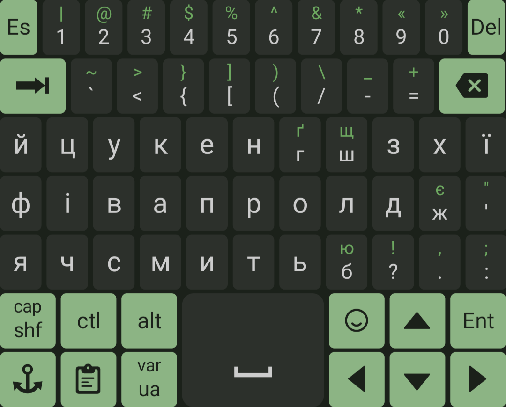

# CustomKeyboardEngine layouts

## For more information refer to [CKE readme](https://github.com/roalyr/CustomKeyboardEngine/blob/main/README.md) and [CKE reference manual](https://github.com/roalyr/CustomKeyboardEngine/blob/main/app/src/main/res/raw/reference.md).

### 1. keyboard_en_default [LINK](keyboard_en_default.json)

Default layout that mimics QWERTY as much as it is conveniently possible.
Application re-creates it on the first launch (or on demand) and uses it as a fallback.

 Screenshot 

---

### 2. keyboard_en [LINK](keyboard_en.json)

Default layout that mimics QWERTY as much as it is conveniently possible.
Has re-arranged symbols.

 Screenshot 

---

### 3. keyboard_ua [LINK](keyboard_ua.json)

Українська розкладка клавіатури, котра поєднує в собі компактність і 
більш логічне розміщення символів (аналогічно [keyboard_en](keyboard_en.json))

 Screenshot 

---
